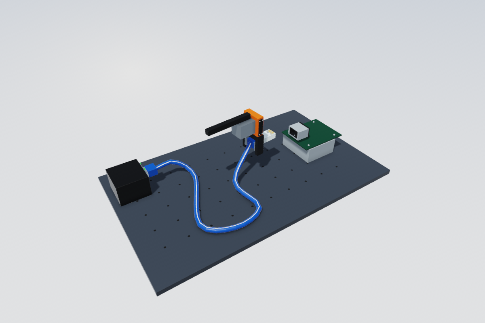
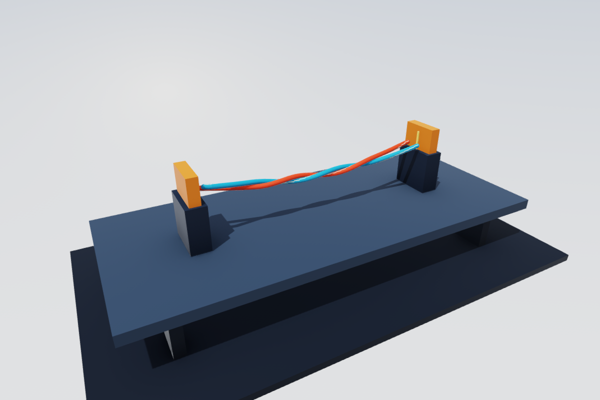
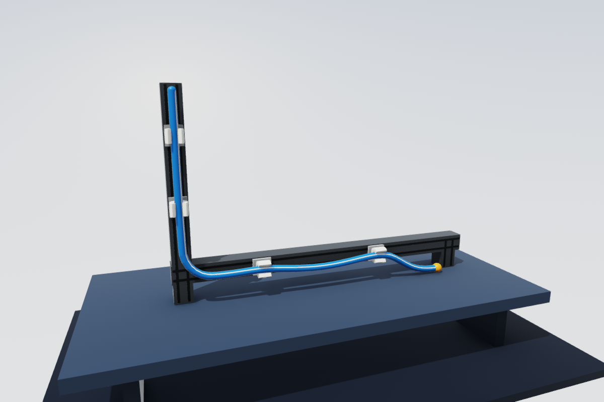
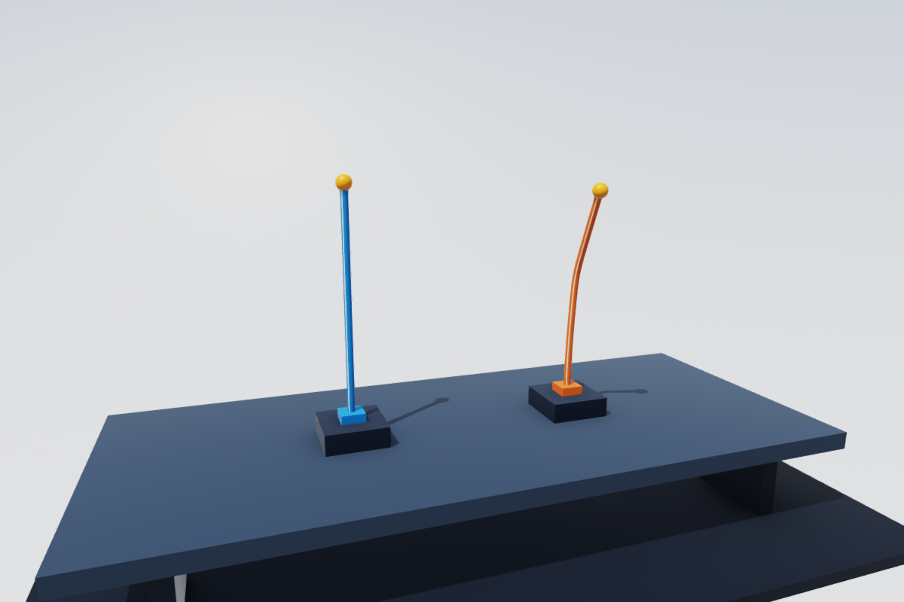

# Elastic and plastic cables

`PhysicsScene.addCable` creates a native elastic rod from a polyline. Each
segment has six degrees of freedom, cylinder mass/inertia, a capsule collider,
and a material frame whose local +Z follows the segment. `scene.cables` retains
body IDs, joint IDs, rest lengths and endpoint anchors. These IDs work with
ordinary body state updates, picking, rendering and rigid attachments.

```swift
import GPUSim

var scene = PhysicsScene(name: "Cable")
scene.settings.dt = 1 / 240
scene.settings.iterations = 24
let radius: Float = 0.015
let cable = try scene.addCable(
    points: (0...32).map { F3(Float($0) * 0.05, 0, 1.5) },
    radius: radius,
    density: 1200,
    material: .circular(radius: radius, youngModulus: 2e7,
                        poissonRatio: 0.3, dampingTime: 0.01),
    fixedSegments: [0])
let solver = try GPUSolver(scene: scene)
try solver.submitStep()
try solver.synchronize()
print(solver.bodyPosition(cable.bodyIDs.last!))
```

Use `Demos.make("cables")` for suspended cables of different bend stiffnesses
with a rigid payload. The existing analytic capsule renderer requires no new
mesh upload or CPU skinning pass. `scene.replicated` remaps cable metadata and
constraints along with the other scene objects.

## Material and attachment model

`CableMaterial` accepts stretch rigidity EA and shear rigidity GA in newtons,
bend rigidity EI and twist rigidity GJ in N m², and a Kelvin–Voigt relaxation
time in seconds. `circular` computes these from Young's modulus, Poisson's
ratio and the circular cross section; its shear correction factor is one.
Alternatively, author the four rigidities independently. Bend and twist may
be zero; stretch and shear must be positive and finite.

Each connection divides these rigidities by the mean adjacent segment length.
Changing resolution therefore preserves the underlying material coefficients
instead of retaining a resolution-dependent per-joint spring constant. Use
SI units consistently for geometry, density, gravity and material parameters.
The capsule's overlapping end caps contribute collision geometry, not extra
mass: total cable mass is density × cross-sectional area × polyline length.

The initial polyline is stress-free, including curved shapes. Frames are
parallel-transported along the polyline. Optional `rotations` can author the
material phase; each must be a unit quaternion with +Z along its edge. Invalid
geometry, fixed-segment indices or frames throw before any scene mutation.

`fixedSegments` clamps complete segments. To pin just an endpoint, author a
normal ball joint using `startAnchor` or `endAnchor`:

```swift
// Author before constructing the solver. The world point should coincide
// with the endpoint at rest (the body's rotation maps its local anchor).
let first = cable.bodyIDs[0]
let point = scene.bodies[first].position
    + scene.bodies[first].rotation.act(cable.startAnchor)
scene.addJoint(SceneJoint(bodyA: -1, bodyB: first,
                         rA: point, rB: cable.startAnchor))
```

For a moving rigid attachment, use that body's ID for `bodyA` and its local
anchor for `rA`. Set `stiffnessAng: .infinity` to clamp orientation as well.
Use an unfixed endpoint segment when pinning it. Branches can share a rigid
attachment; custom elastic connections can set `SceneJoint.cable` to a
`CableJointMaterial` while leaving the ordinary joint stiffnesses zero.

Adjacent segments are excluded from collision through their joint topology.
Nonadjacent segments and other bodies use the existing capsule narrow phase,
friction, collision groups and exclusion APIs. Cable friction anchors rotate
with the segment material. Contact is discrete: choose a timestep and segment
length appropriate to the radius, speed and curvature. There is no new CCD
guarantee. Authoring also excludes local pairs whose intervening rest arclength
is shorter than the diameter. This prevents overlapping capsule caps from
fighting the material at high resolution; distant folds and separate cables
retain contact.

## Energy and solver integration

For parent and child poses `(xA, RA)` and `(xB, RB)` with anchors `rA`, `rB`:

```
c = RAᵀ (xB + RB rB - xA) - rA
e = log((RA Rrest)ᵀ RB)
E = ½ cᵀ diag(GA, GA, EA)/L c + ½ eᵀ diag(EI, EI, GJ)/L e
```

`Rrest` is the authored relative orientation. The principal SO(3) logarithm
expresses bend/twist in the rest-child material frame. The angular law has
exact linear torque versus angle for pure bend or twist. This is a discrete
Cosserat-style material, distinct from Newton's curvature-binormal/Bishop
bend-twist split. At large simultaneous bend and twist the models differ.
Neighboring rest-relative rotations must stay below pi; refine the cable for
tight bends or concentrated twist. Optional bending plasticity is described
below. Fracture, a dedicated cable friction law, and a continuous surface mesh
are not implemented.

The damping potential is `½ (dampingTime/dt) Δcᵀ K Δc` plus the analogous
angular term. Initial strains are cached before prediction, and analytic
Jacobians stamp the force and positive-semidefinite Gauss–Newton blocks into
the existing AVBD 6×6 solve. The moving parent frame is differentiated, which
preserves the coupled translation/angular response. A small-angle series
avoids cancellation in the logarithm Jacobian. No finite-difference gradients,
per-iteration allocations or extra CPU/GPU synchronization are used.

These finite material energies share the AVBD iterations with hard joints and
contacts, like existing elastic elements; they do not use adaptive penalties
or multiplier clamping. The cable flag selects a dedicated stamp within the
existing joint dispatch, including scalar, SIMD and fused solver paths. It
uses the inactive motor fields as explicitly tagged material storage and
adds no fields to the existing joint layout. On this branch the record is
256 bytes; PR #36 independently appends joint-response storage, so that
absolute size is not a promise about a future merged layout. The cable tag
is bit 8 (256), separate from physical break loads (64) and finite scalar fracture (128). No
cable-only buffers or dispatches are added. Elastic undamped joints skip history evaluation; zero angular rigidity skips
the angular logarithm. Reset preserves the material coefficients.

## Interactive Cable Lab

```sh
swift run -c release cable-playground cablegrippers
```

The standalone macOS viewer has a scene picker, pause/reset, material damping
and environmental drag sliders, and these four demos. The Development app
also lists them.

| Scene ID | Interaction |
|---|---|
| `cableethernet` | Watch a compliant tool insert a deformable Ethernet plug; the cable connects to a second fixture through a service loop. |
| `cabletwisting` | Two clamped, striped strands wind into a braid. |
| `cablegrippers` | Pull a routed cable out of four white C clips on a grooved L frame. |
| `cableplastic` | Bend the blue elastic and copper plastic cantilevers; release to compare spring-back. |



The Ethernet task uses a 22.48 × 11.68 × 6.60 mm plug, a polycarbonate FEM
housing, a bending latch, eight spring contacts, and a rigid shielded socket
on a PCB fixture. An automatic wrist trajectory acts through a compliant tool
holding the rear boot. Plug deformation and seating come from the physical
solve. The display reports insertion depth, tool load and task phase; an
excessive load stops the drive. See [the task model and calibration assumptions](EthernetInsertion.md)
for dimensions, material references, force limits and headless qualification.

Build a self-contained macOS app with `make cable-app`; the result is
`.build/Cable Lab.app`. This packages the executable with its matching shader
resources. Copying only the executable can accidentally load a newer SwiftPM
build bundle with an incompatible joint ABI. The solver now rejects cable
flag or joint-stride mismatches during shader compilation. A two-minute
unattended routing regression also checks every step for detached links.





Left-drag a cable to grab it. Option-drag or drag empty space to orbit,
right-drag to pan, and scroll to zoom. Space pauses; R resets. The gold ends and blue Ethernet boot are pickable. Clips are conforming tetrahedral soft bodies with pinned rear
surfaces and freely deforming lips. Retention and release come from contact,
without cable-to-clip joints. The clip scene enables contact-aware coloring.

For a reproducible render:

```sh
swift run -c release cable-playground cabletwisting --snapshot /tmp/braid.png --steps 2400
```

The twisting drive keeps adding turns; turn it down or pause to inspect the
braid. The regression covers 30 simulated seconds at the default drive rate,
not unlimited winding or arbitrary speed.

## Damping and permanent bending

Internal damping acts on changes in material strain, so it does not damp a
uniform translation. A slow mode can remain underdamped despite strong
high-frequency damping. The interactive presets use `dampingTime = 0.12 s`
and the existing scene-level rigid viscous drag at `0.8 /s`. Both controls
can be set to zero. Drag applies to all dynamic rigid bodies in the scene,
using `v *= exp(-drag * dt)` (and the corresponding angular velocity rule).
It is an environmental dissipation approximation, not a fitted air model:
there is no wind field, directional drag coefficient, or Reynolds-number law.
The values are illustrative presets, not measurements of a particular cable.

For a cable that keeps a permanent bend, pass `yieldCurvature` in radians per
metre to `CableMaterial` or `.circular`. Nil preserves the elastic behavior.
For example, `bendRigidity: 0.8` and `yieldCurvature: 1.5` give a 1.2 N m
bending yield moment regardless of segment resolution. Stretch and twist
remain elastic; length does not plastically grow.

The plastic law is isotropic, rate-independent, ideal plastic bending in the
two rest-frame bending coordinates. With total angular strain `e`, committed
plastic bend `p`, and `y = yieldCurvature * L`, form the trial `b = (e-p).xy`.
Project `b` onto the disk of radius `y` to obtain elastic bending strain.
This is the gradient of a quadratic/linear incremental bending energy;
the radial-return tangent is positive semidefinite. Unloading is elastic,
and loading beyond the threshold changes the stress-free bend. No hardening,
Dahl friction model, viscoplastic creep, or plastic twist is implied.

The preceding accepted pose commits plastic state once at the next step's
warmstart. Every current primal iterate uses a return-mapped trial against
that fixed history; solver iterations never accumulate plastic deformation.
Damping uses the change in **total** strain, avoiding a spurious damping
impulse when the plastic rest state changes. Plastic state reuses the cable
joint's inactive `lambdaAng` storage, and the yield angle uses `limits.w`.
No buffer, dispatch, or CPU readback is added. `setDrivenBodyStates` preserves
material history; episode resets through `setBodyStates` clear plastic state
on incident cable joints. Recreating the solver also restores authored rest.

Newton offers a [Dahl cable hysteresis example](https://github.com/newton-physics/newton/blob/main/newton/examples/cable/example_cable_bundle_hysteresis.py).
This implementation uses the simpler return-map law above and does not claim
to reproduce that model or measured cable hysteresis.

## Collision corrections and coverage

The twisting regression originally measured 53.8 mm overlap between 54 mm
diameter strands. The contact Taylor value used reference-frame pose deltas
with current-frame lever arms, allowing axial spin to invent normal separation.
Cable capsule contacts use reference lever arms consistently in primal and
dual updates, including torsional-friction load bounds, packed and fallback
Metal paths, and the CPU reference. Only analytic material capsules owned
by `scene.cables` or by joints with `SceneJoint.cable` opt into this policy.
One-segment cables are included; ordinary attachments do not opt in their
other body. Contacts without cable participants, including authored humanoid
and arm capsules, retain their prior policy. This applies to cable/cable and
cable/rigid analytic or convex contacts. Legacy world-offset round anchors
retain their convention.

The shared segment-distance query also uses scale-relative parallel tests
and a cross-product denominator, so short or near-parallel crossing segments
keep their interior witnesses.

| Interaction | Scope |
|---|---|
| Cable / cable, including distant self-contact | Corrected segment query, consistent contact frame, local rest-arclength exclusions. |
| Cable / box, sphere, torus, convex hull | Consistent contact frame; existing shape-specific collision geometry remains. |
| Cable / soft body | Native cables use a full-axis closest witness against triangle interiors and edges; closed tet boundaries use outward contact normals. Ordinary rigid capsules retain three sphere samples. |

Full-axis coverage is spatial, not a sweep through time. Clip retention, lip
deformation, mouse release and millimetre-scale contact wires are tested.
This is not a general no-crossing guarantee for thin or rapidly moving soft
surfaces. Discrete contact permits solver slop and can tunnel under sufficiently
large motion.

## Validation and performance

Run the standalone CPU/Metal validation without XCTest or external packages:

```sh
swift run -c release cable-validation
swift run -c release cable-validation --benchmark
swift run -c release cable-validation --materials
swift run -c release cable-validation --rigid-contact
swift run -c release cable-validation --shader-regressions
swift run -c release cable-validation --motion-groups
swift run -c release cable-validation --ethernet
swift run -c release cable-validation --collision-stress
swift run -c release cable-validation --collision-stress --segments 80
swift run -c release cable-validation --collision-stress --mixed
swift run -c release cable-validation --demos
swift run -c release cable-validation --compatibility
```

`--cpu-only` runs without a Metal device. The cable GitHub Actions workflow
uses a full-Xcode macOS runner for the CPU XCTest cases and physical checks;
Metal validation and timings run on a local Apple GPU.

The validation covers atomic authoring, mass accounting, material anchors,
replication, analytic Jacobians, quaternion sign invariance, curved rest
shapes, axial Hooke equilibrium, torsion, free material spin, nonlinear
cantilever moment balance, floor contact, guided interior cable/cable contact,
CPU/Metal transient parity, and
reset/fresh equivalence. XCTest adds full force-versus-energy derivatives on
both bodies, positive-semidefinite blocks, contact-normal order reversal,
authoring edge cases and demo/ABI checks:

```sh
swift test --filter Cable
python3 -S Tools/verify_architecture.py
python3 -m unittest discover -s Tools/tests -p test_verify_architecture.py
```

The floor regression also fixes the existing CPU capsule/box normal sign;
the prior normal pushed a falling capsule into the box instead of supporting
it. The two collider orderings now follow the same B-to-A normal convention.

Benchmark timings are end-to-end wall time including submission and final
synchronization, excluding solver construction and shader compilation. The
benchmark uses a 1/240-second step, 12 iterations, 60 warmup frames and five
120-frame samples, reporting their median. It includes both suspended cables
with contact disabled and cables resting on box floors with contact enabled.
These measure this Metal backend; they are not a speed comparison with
Newton/CUDA on different hardware.

Measured on 2026-09-11: Apple M5, macOS 26.5.2, Swift 6.3.3, release build:

| Segments | No contact, ms/frame | Floor contact, ms/frame | Floor pairs |
|---:|---:|---:|---:|
| 16 | 0.2114 | 0.3844 | 16 |
| 256 | 0.2156 | 0.4376 | 256 |
| 1,024 | 0.2494 | 0.6700 | 1,024 |

These are current implementation timings, not a controlled speedup comparison
against the earlier commit. The GPU was not rendering Cable Lab during this run.

All benchmark states remained finite. Maximum connector gaps at 1,024
segments were 0.005835 m suspended and 0.000044 m on the floor, for 0.1 m
segments with EA = 2,000 N, GA = 1,000 N, EI = 0.5 N m² and GJ = 0.2 N m².
The benchmark checks gaps below 0.01 m; the reported gaps include physical
elastic deformation and finite-iteration error, not just numerical error.

An ordinary finite-joint control (no cables or contact, 12 iterations, seven
240-frame samples after 60 warmup frames) compared this implementation with
base commit `4f5be05`: 256 bodies measured 0.2960 → 0.2997 ms/frame and 1,024
bodies 0.3260 → 0.3195 ms/frame. Sample ranges overlapped, so this control did
not show a meaningful regression or establish a speedup.

The standalone CPU and Metal checks, full release build, architecture gate,
and 23 architecture unit tests passed on that machine. `swift test --filter
Cable` could not compile because XCTest is absent from Command Line Tools;
the XCTest cases require a full Xcode installation. No Newton runtime
benchmark was run on this Mac.

Reference: [Newton's rod kernels at 811b7b1](https://github.com/newton-physics/newton/blob/811b7b1ac803e193f063819d6e5d085cebdcddf6/newton/_src/solvers/vbd/rigid_vbd_kernels.py)
and [rod authoring API](https://github.com/newton-physics/newton/blob/811b7b1ac803e193f063819d6e5d085cebdcddf6/newton/_src/sim/builder.py).
The Swift/Metal constitutive implementation here is independently derived.

The isolated 15-second torsional ring-down checks monotonically decreasing
mechanical energy and agreement with the analytic Kelvin–Voigt oscillator.
CPU/Metal retain about 42% of initial energy at 25 ms damping versus 2.4% at
120 ms. Internal damping preserves bulk translation; environmental drag at
0.8 /s leaves the expected 0.4493 m/s from an initial 1 m/s after one second.
The plastic release check retains 0.400 rad from a 0.500 rad imposed bend
with a 0.100 rad yield threshold; its elastic control returns to straight.
Loading/reversal dissipation, the two-axis force tangent, and episode reset
are checked separately. These controlled tests diagnose material behavior;
they do not rule out all contact or finite-iteration artifacts in every scene.

The final 30-second twisting test uses an independent double-precision
segment-distance oracle every step and rejects non-finite/escaped poses or
connector gaps above 25 mm. At 40 segments per strand it measured a maximum
3.52 mm overlap and 1.57 mm connector gap; the mixed convex/analytic pipeline
matched. At 80 segments it measured 2.58 mm overlap and 1.93 mm connector gap.
These overlaps include the 1.5 mm configured contact slop. A capsule spinning
at 80 rad/s on a box measured the same support height as the nonspinning
control (CPU overlap 2.65 mm, Metal 1.49 mm). The existing gear-clock
compatibility regression also passes.

For the permanent-bend screenshot below, use:

```sh
swift run -c release cable-playground cableplastic --snapshot /tmp/bend.png --bend-release --steps 2400
```

That script grabs each gold tip with the ordinary 50 N/m mouse spring,
releases it, and waits before rendering. It does not rewrite body poses or
material rest state to create the picture.



The shader regression appends a probe to the checkout's production Metal
source. It checks both torsional-friction routines against a known 1 N
normal load while a capsule spins, verifies that an unflagged contact keeps
its prior behavior, and checks explicit cable adjacency with zero shear
storage, separation from break-load flags, and Swift/Metal joint stride.
It does not add test kernels to the shipped solver library. CPU ownership
regressions also cover single segments, custom cable joints, replication,
and ordinary authored capsules. The focused CI workflow follows cable files
and their shared solver dependencies on both PRs and pushes to main.

Additional demo checks:

```sh
swift run -c release cable-validation --ethernet-authoring
swift run -c release cable-validation --ethernet
swift run -c release cable-validation --routing-soak
```

The Metal insertion regression pushes the plug into the jack and withdraws
it using the viewer's 50 N/m spring. It checks cable continuity, positive tet
volumes, back-wall clearance, and a second, off-axis push against the socket
face using an independent oriented-box penetration oracle. On the M5 the
aligned sequence retained at least 46% of each tet's rest volume; the off-axis
nose stopped at the face with no vertex penetration at the final sample.
These are finite-step regressions, not a guarantee against arbitrary-speed
continuous collision or every possible drag path.
