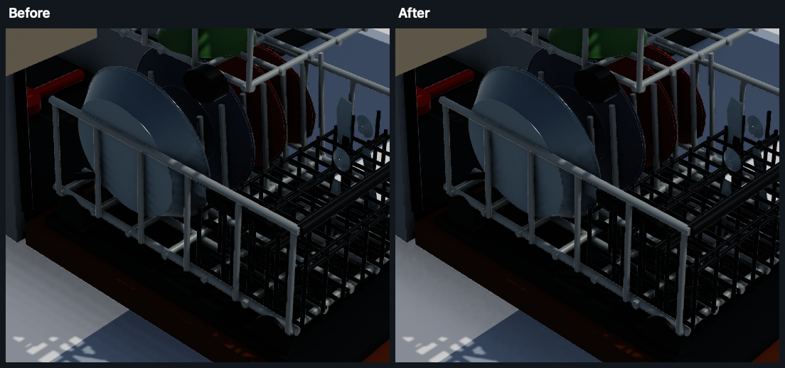

# GTAO sampling and validation



The renderer uses half-resolution depth32/normal buffers, three horizon slices,
four steps on each side (24 depth taps), temporal accumulation, and a 13-tap
bilateral blur. No additional pass or texture is needed for the striping fix.

## Why the bands survived earlier fixes

[PR #10](https://github.com/LuckyIYI/avbd-metal/pull/10) addressed receiver-plane
shadow bias and temporal AO ghosting.
[PR #13](https://github.com/LuckyIYI/avbd-metal/pull/13) corrected PCF tap depths
and caster bias. The dishwasher's remaining stripes disappear with AO disabled
while directional shadows remain enabled.

There were three separate AO defects:

- The nearest depth sample was unprojected at a continuous UV instead of the
  sampled texel center. This invents height changes on sloped planes. Clamping
  off-screen depth while extrapolating its position also invents geometry.
- The radius jitter was derived from the same linear interleaved-gradient
  noise as the slice angle, and was shared by every slice and step. Its diagonal
  correlation survives temporal accumulation and bilateral filtering around
  real occluders. Independent hashed angle/radius seeds and a per-stratum
  low-discrepancy offset remove that structure.
- Even correctly snapped samples leave the ideal slice plane. Samples on or
  below the receiver tangent plane cannot occlude its normal hemisphere. A
  small tolerance covers normal quantization and depth roundoff. In addition,
  integrating occlusion relative to each analytic open slice, then subtracting
  it from one, gives exactly unit visibility for an unoccluded hemisphere.
  Estimating and clamping the entire open hemisphere with three slices caused
  a normal-dependent dark bias.

The horizon search now works in camera space. Perspective depth is linearized
as `viewZ = B / (deviceDepth - A)`, and texel-center rays use the actual
projection's inverse focal scales. This avoids a matrix multiply at every tap
and world-origin cancellation. Opposite taps share their offset calculation;
unchanged horizons skip the remaining trigonometric integration exactly.
Temporal reprojection still uses world space;
its nearest depth is now reconstructed at the corresponding texel center too.

The radius, falloff, contrast curve, history blend, and denoising footprint are
unchanged. This remains a screen-space approximation: hidden/off-screen
occluders are unavailable, and fading a horizon is not equivalent to tracing
distance-weighted visibility along every hemisphere ray.

## Reproduce the checks

`GTAOMetalTests` compiles the **production shader source**, renders analytic
geometry to real depth32/rgba16Float targets, and executes the production
R8/RGBA8 AO, temporal, and blur passes. It checks:

- Raw and resolved visibility of unoccluded planes, including grazing angles,
  screen edges, odd target sizes, different distances and translated origins.
- Contact occlusion and far-field visibility against an independent,
  cosine-weighted geometric ray integral with 16,384 rays per probe.
- Directional correlation on an occluded plane whose true visibility is
  constant down each image column. This catches sampling bands that a mean-AO
  assertion misses.

```sh
swift test --filter GTAOMetalTests
GTAO_TEST_OUTPUT=/tmp/gtao-images swift test --filter GTAOMetalTests
GTAO_TEST_BENCHMARK=1 swift test --filter testAOChainBenchmark
```

For A/B verification, save the old renderer Swift file with `git show` and set
`GTAO_TEST_SHADER` to its path. That override exists only in the test harness.
The old shader fails the plane and directional-noise regressions. Its residual
directional correlation was 0.89; the corrected estimator measured 0.11.

The opt-in benchmark measures the entire AO/temporal/blur chain at 1440×858
(half a 2880×1716 drawable), excluding the analytic geometry setup and readback.
Run comparisons serially on the same GPU without other render workloads.

Validation on Apple M5 (2026-09-04), comparing main `48e9075` with this fix:

| Check | Before | After |
| --- | --- | --- |
| Worst resolved visibility on the tilted-plane fixture (`N.z = 0.5`) | 0.73 | 1.00 |
| Directional residual correlation, occluded plane | 0.892 | 0.114 |
| AO chain, median of three 120-frame GPU measurements | 1.604 ms | 1.578 ms |

The timing difference is small; treat performance as unchanged, not a general
speedup claim. The final dishwasher preview also ran at 60 FPS at 2240×1520,
with contact AO and directional shadows enabled. An isolated copy of the
TeleopKit dishwasher scenario supplied the visual reproduction; no host
application or dependency pin was changed.

The final 16 ordinary renderer tests pass in Debug and Release; the additional
opt-in benchmark passes separately. Package-consumer build and architecture
checks pass. The broader Release suite exposes unrelated physics failures:
`MarbleRunTests.testMarblesReachThePool` and, intermittently,
`PlanarDATTests.testSoftContactOverflowRestoresStepStartPoseBeforeTypedFailure`.
The latter passes in isolation. These tests do not execute the renderer and
their physics sources are unchanged by this fix. The marble failure also
reproduces in a separate package archived from main `48e9075`, containing only
SimCore, PhysicsAVBD, GPUSimDemos and that test, with no renderer target.

The older `PhysicsAVBDTests/GTAOReferenceTests` preserves the historical
world-position estimator. It does not validate the current depth-buffer path.

Reference: [Intel XeGTAO](https://github.com/GameTechDev/XeGTAO) documents GTAO's
slice integration, nearest-depth texel-center requirement, near-field horizon
falloff, and stratified sampling. The renderer retains those principles while
using its own temporal resolve and occluded-arc integration.
