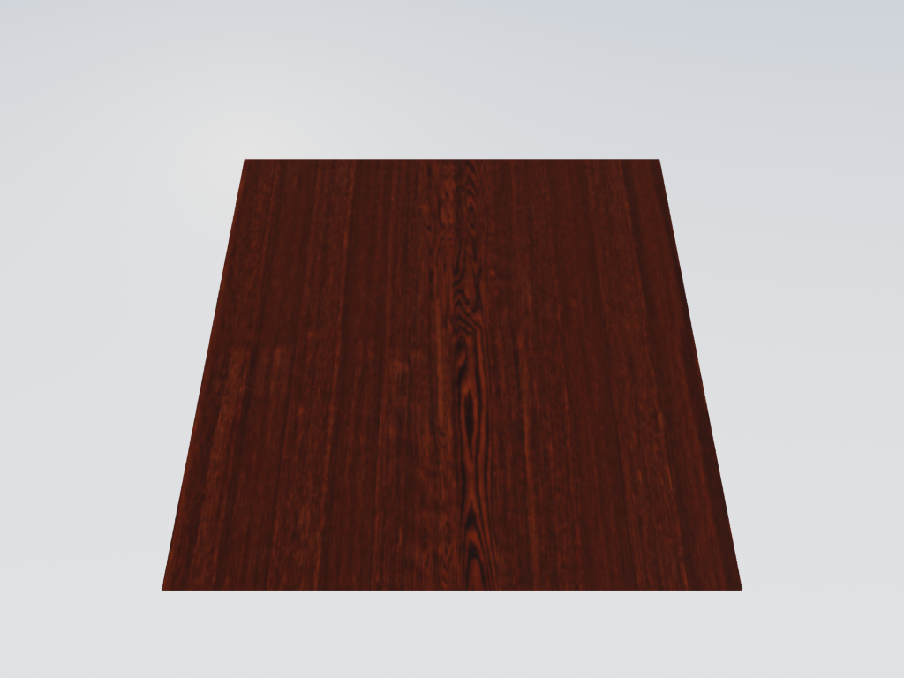

# Surface materials and asset import

The renderer has one opaque metallic/roughness material evaluator for Fast PBR,
HQ surface buffers, MetalFX guides, reflected hits, and diffuse ray hits. There
are no named wood/stone/ceramic branches in engine shaders.



This is the renderer output for the optional CC0 Wood Table 001 image maps, not
an engine preset. Attribution and reproduction commands are in the example README.

## Image materials

```swift
var material = GPUSimSurfaceMaterial()
material.baseColorTexture = try GPUSimMaterialLibrary.loadTexture(
    device: device, url: colorURL, sRGB: true)
material.normalTexture = try GPUSimMaterialLibrary.loadTexture(
    device: device, url: normalURL, sRGB: false)
material.roughnessTexture = packedORM
material.metallicTexture = packedORM
material.roughnessChannel = 1
material.metallicChannel = 2
material.roughness = 1
material.metallic = 1
let library = try GPUSimMaterialLibrary(device: device, materials: [material])
let renderer = try GPUSimRenderer(device: device, scene: solver, materials: library)
```

`SceneRigidMesh.textureCoordinates` contains one UV per vertex;
`materialID: 1` selects the first library entry. Zero uses vertex PBR unchanged.
Color factors are linear and multiply vertex color/body appearance overrides;
use white vertices for an untinted asset. Roughness/metallic factors multiply
the selected map channel. Emission is linear HDR. Opacity is deliberately outside
this opaque path: base-color alpha is not alpha testing or transmission.

UV origin is top-left. Normal maps are tangent-space RGB; `invertNormalGreen`
adapts maps authored with the opposite tangent Y direction. The importer flips
both authored bottom-left UVs and normal-map green. Tangent frames are reconstructed
from triangle UVs in raster and rays, including mirrored UV handedness. Degenerate
UVs fall back to the geometric shading normal. This is not MikkTSpace tangent
interpolation; assets requiring that exact basis need a future tangent attribute.

Images retain independent sizes, formats and mip chains. The image loader explicitly
sets color space and generates mipmaps. Sampling uses repeat or clamp-to-edge with
trilinear filtering and footprint-selected LOD. Raster uses UV derivatives; rays
estimate UV density from the hit triangle and projected ray footprint. This is
isotropic filtering, not anisotropic ray differentials.

## Caller-authored procedural materials

```swift
let program = GPUSimMaterialProgram(body: """
    surface.color *= mix(float3(1), context.parameters.xyz,
                         smoothstep(0.2, 0.8, context.uv.x));
    surface.roughness = context.parameters.w;
    """)
material.program = 1
material.parameters = SIMD4(0.2, 0.4, 0.8, 0.35)
let library = try GPUSimMaterialLibrary(
    device: device, materials: [material], programs: [program])
```

A program receives `context.position` (body-local metres), `context.uv` (after
material UV transform), `context.footprint` (UV units per sample), and four authored
parameters. It modifies linear `surface.color`, `roughness`, `metallic`, `emission`,
and tangent-space `normal`. Standard image/factor evaluation runs first, so a
program can also decorate image materials. Programs must handle their own procedural
antialiasing and may not use fragment-only derivatives. Helper functions/constants go in
`supportingSource`, in a separate namespace per program. The API is trusted application
shader code, not a sandboxed shader language.

Programs compile once per material library/pipeline family. Compilation errors
throw before frames are submitted. Material libraries are immutable and can be
shared by cameras; create a new renderer/library when changing material resources.
Do not mutate underlying MTLTextures while frames are in flight. Remote scene data
must reference locally registered materials/programs; do not compile network-provided
MSL. No phone asset-transfer protocol is supplied by this renderer API.

## Resources and limits

The argument buffer supports 128 distinct texture objects per library
(`GPUSimMaterialLibrary.textureCapacity`); the same image reused by multiple
channels/materials is bound once. This is an explicit limit with an error, not
silent truncation. Textured materials require Metal argument-buffer tier 2; on
tier 1 devices the shaders compile with a stub resource block so a material-free
renderer still runs. All textures must belong to the render device, be sampled
2D resources, and fit the configurable allocation budget (default 512 MiB). Ordinary
image dimensions (at most 16384 per side) are checked before decoding with an
estimate that follows the source bit depth: RGBA8 for 8-bit images, RGBA16 for
deeper integer images, RGBA32F for floating-point sources, each with mips. The
loader still checks actual allocated bytes afterward. Compressed containers not
understood by ImageIO only get the post-load check. `GPUSimMaterialLibrary.validate`
runs the same material checks without allocating GPU resources.

`GPUSimRenderOptions.ambientExposure` scales the indirect diffuse sky/ground
irradiance only. The sky dome, horizon fog and the specular environment seen in
reflections keep their brightness so a mirror always matches the drawn sky.

Resources are registered on every consuming render/compute encoder. Shader libraries
and acceleration structures are cached across cameras sharing the same material
library. Material identity is part of the ray-world cache key, preventing one camera's
programs from shading another camera's scene. There are no material-specific draw calls.

Rigid vertex ABI is 64 bytes: position/body, normal/roughness, color/metallic, UV/material.
The material ID must be identical on all corners of a triangle. Rebuild manually
packed vertex buffers when upgrading from main's 48-byte ABI. The earlier PR-only
`surfaceDetail` payload and procedural presets are removed.

## Imported assets

```swift
let asset = try GPUSimAssetImporter.load(url: modelURL, device: device)
for part in asset.parts { scene.addRigidMesh(part.rigidMesh(body: bodyID)) }
let materials = try GPUSimMaterialLibrary(device: device, materials: asset.materials)
for diagnostic in asset.diagnostics { print(diagnostic) }
```

The Model I/O path preserves triangle submeshes, material assignment, UVs, normals,
and flattened hierarchy transforms at time zero. Inverse-transpose normals and
reversed winding handle mirrored/nonuniform transforms. It imports base color,
roughness, metallic, tangent normal and emission maps/factors, deduplicating textures.
An imported USD map replaces the constant for its channel (factor 1), matching USD
connection semantics. OBJ color maps multiply the authored `Kd` tint. Authored USD
inputs take precedence over Model I/O's default-named material properties, and out-of-range scalars are clamped to 0...1.
Missing textured UVs, nontriangle topology, singular transforms, excessive geometry,
and explicit nonopaque materials fail with errors. Every error thrown by `load` is a
`GPUSimAssetImporter.Failure`; library and image-loader failures are mapped onto it.
Unsupported per-map samplers, transforms and displacement are reported in diagnostics.

OBJ and USD have executable fixtures. `canImport` reports actual platform Model I/O
capability. **There is no native FBX decoder in this contribution**: convert FBX to
USD/OBJ with a tool that preserves materials, then import the converted asset.
This does not implement USD composition editing, skeletal animation, articulation
import, collision decomposition, arbitrary material graphs, or specular/glossiness
conversion. Visual meshes do not replace authored simulation colliders or joints.

See [the reproducible preview](Examples/Materials/README.md) for actual image maps
and both rendering modes. Tests use local fixtures; builds never fetch assets.
