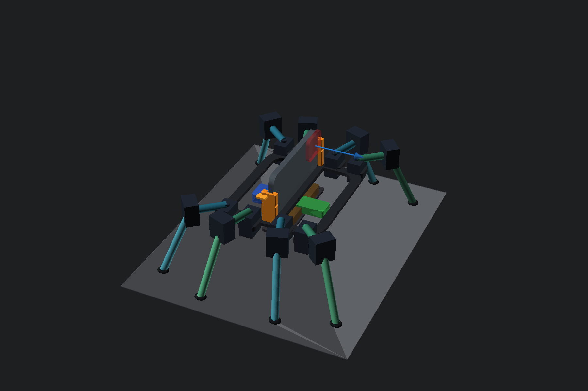
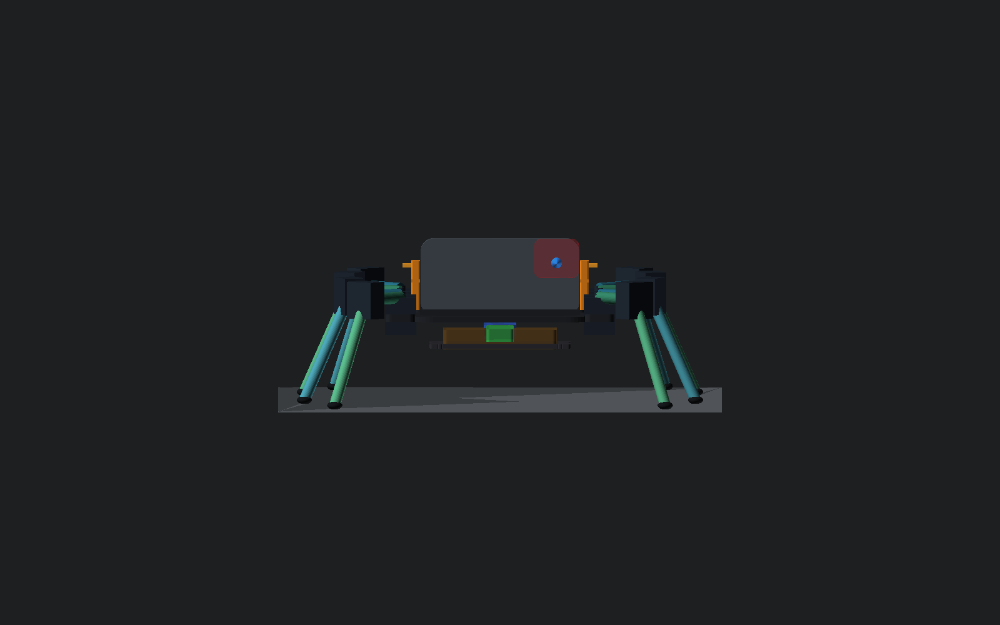
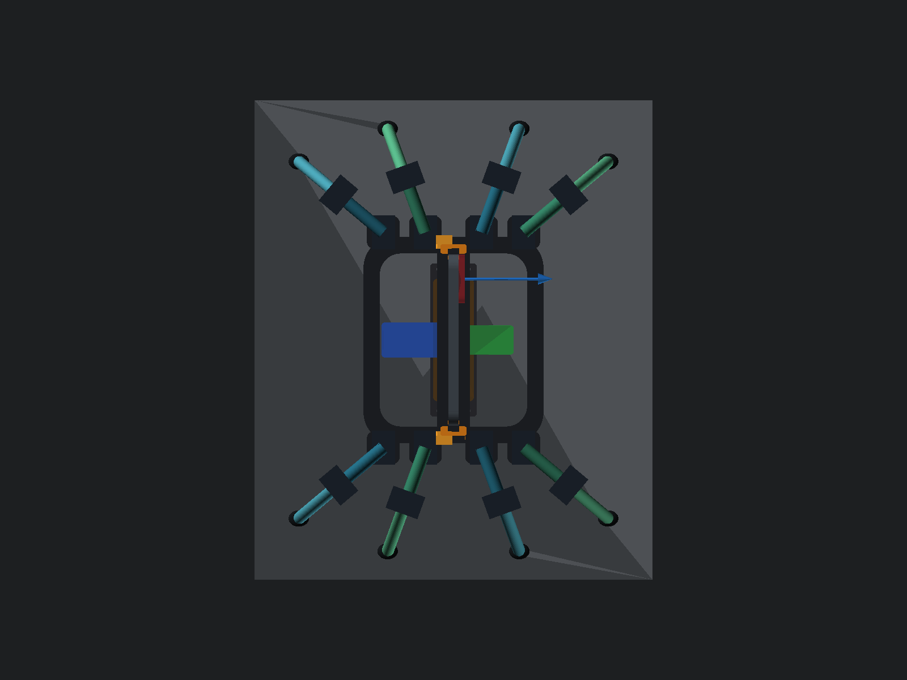
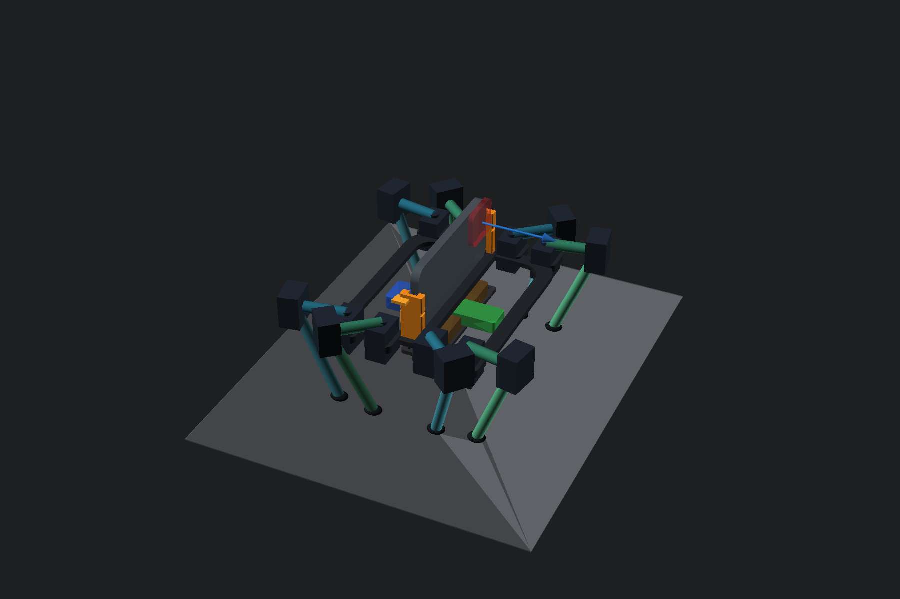

# Arachne-15

A source-controlled concept for an eight-legged robot whose centrally mounted
iPhone 15 Pro performs high-level perception and control. This revision is
designed to be physically plausible on a flat floor and honest about what has
not yet been proven.







## Geometry

| Item | Nominal dimension |
|---|---:|
| Bare iPhone 15 Pro | 146.60 × 70.60 × 8.25 mm; 187 g |
| Landscape dock cavity | 9.45 mm thick × 147.80 mm wide |
| Chassis ring | 154 × 176 × 5 mm; 154 × 212 mm with hip pods |
| Body ground clearance | 76 mm |
| Coxa axis spacing | 50 mm |
| Tibia axis spacing | 105 mm |
| Nominal tibia pitch | 65° below horizontal |
| Approximate stance footprint | 265 × 362 mm |
| Actuators | 16 × XC330-M288-T, 20 × 34 × 26 mm body |

Robot forward is `+X`. The phone drops from above into the chassis's transverse
structural spine:
rear cameras face forward, the screen faces backward, and both broad faces stay
open for vision, cooling, and access. Two identical removable U-channel end
guides avoid the camera plateau; TPU-backed wedges and a silicone safety strap
retain the phone. The default 0.60 mm-per-side fit is for a bare phone; measure
and update the parameters before using any case.

The body is derived from this phone position: a 14 mm torsion ring routes all
eight hip loads around the central bay, the transverse phone spine closes the
ring, hip axes sit at `X = ±60/±24 mm, Y = ±92 mm`, and the battery aligns
directly below the phone. The closest guide-to-actuator clearance is 3 mm.

## Can it carry the phone and walk?

The current conservative analytical budget is 1.220 kg including the phone, 16
servos, battery, power electronics, brackets, fasteners, wiring, and margin.
The generated meshes total 278.6 g if printed completely solid; the load budget
rounds this up to 280 g. At ROBOTIS's recommended general-use limit of
20% stall torque:

- available design torque per knee: 0.186 N·m;
- five-leg stance with 1.5× dynamic factor: about 0.158 N·m per knee;
- safety factor: about 1.17;
- six-leg paired-ripple stance: about 1.40 safety factor;
- seven-leg wave stance: about 1.63 safety factor;
- four-leg dynamic stance: fails the design rule.

With the phone vertical in landscape, the estimated whole-robot centre of mass
is 87.3 mm above the floor. The worst seven-foot support polygon retains 95.0
mm of horizontal margin, corresponding to a first-order lateral tip threshold
of 1.09 g. This remains analytical, not a substitute for a tethered prototype.

Therefore the mechanism is *capable on paper* of slow, level-floor wave-gait
walking while carrying the iPhone. It is not yet a walking prototype. Do not
use a fast alternating four-leg gait until measured current, temperature,
deflection, and impact tests establish more margin.

The simulator also includes a non-neural six-support-leg paired-ripple
controller. It is a transparent commissioning fallback and a baseline against
which learned control must earn its complexity; see
[sim/README.md](sim/README.md#classical-cpg--ik-baseline). It does not change
the analytical hardware gates above.

## Arachne Reveal



The existing 16 actuators can also produce a physical compact/deploy sequence;
no extra hinge or visual-only animation is required. The compact guard target
sweeps the hip yaws to `±0.52 rad` and pitches each tibia to `+0.82 rad`. With
the authored 65° tibia mounting angle this carries each foot 22.0° past
vertical and under the chassis, with 0.08 rad remaining before the knee stop.

The verified kinematic envelope changes from **284.6 × 381.4 mm** deployed to
**238.4 × 268.6 mm** compact, a **41.0% area reduction**. The compact support
polygon retains 70.5 mm of origin margin and the closest pair of leg beams
retains 9.24 mm clearance. This is a stable guard/storage pose, not a flat or
pocket-sized fold.

The simulator executes the reveal through the ordinary position motors,
gravity, friction, joint limits, and contacts. Two balanced diagonal four-leg
waves lift, sweep, and plant to fold. Deployment first lowers all eight knees
into a shared-load transport crouch, reverses those waves, then raises the
body. The brief commissioning maneuver uses 0.372 N·m per joint—40% of
the selected servo's 5 V stall torque—and restores the 0.186 N·m walking
budget before handing the measured state back to the learned or classical
controller. The deployed geometry and learned action contract are unchanged,
so existing revision-6 policies do not require retraining.

Run the exact geometry gate with:

```sh
python3 analysis/reveal_pose.py --check
```

This is still a pre-prototype result. Servo brackets, cables, connector loops,
current limiting, temperature, and the complete swept volume need a slow,
tethered hardware test. Do not copy the simulated transient torque scale to a
robot until the bridge enforces measured current and thermal limits.

Run the exact calculation:

```sh
python3 analysis/load_case.py
```

## Control and power architecture

```text
iPhone 15 Pro (vision, policy, planning, UI)
        │  BLE / local Wi-Fi, heartbeat + timestamped commands
        ▼
ESP32-S3 safety bridge (watchdog, gait interpolation, TTL half-duplex)
        │
        ├── fused branch A ── 4 × XC330
        ├── fused branch B ── 4 × XC330
        ├── fused branch C ── 4 × XC330
        └── fused branch D ── 4 × XC330

2S LiPo ── master switch + 25–30 A fuse ── regulated 5 V / 20 A BEC
```

The iPhone is the high-level brain; the bridge is a deterministic reflex and
bus controller. Loss of heartbeat must lower the body, torque-limit the joints,
and then disable torque. The servo rail is electrically separate from the
iPhone. An optional phone-charging regulator needs its own current limit and
noise testing.

## Build the CAD

OpenSCAD `2026.06.12` is installed at `/Applications/OpenSCAD.app` and linked as
`openscad`. From this directory:

```sh
./scripts/build_cad.sh
```

That exports one STL per printable part, deployed and folded assembly PNGs,
load/reveal reports, and mesh bounds/volume metrics under `build/`. Individual
parts can also be exported directly:

```sh
openscad --export-format binstl -D 'PART="chassis"' \
  -o build/stl/chassis.stl cad/arachne15.scad
```

## Fabrication rules

- Use official ROBOTIS FPX330 frames/idlers at every servo interface. The CAD
  uses the audited 20 × 29 × 34 mm configurator-mesh envelope, FPX330-S102
  16 mm mounting pair, 8.2 mm hub clearance, and PCD12 horn holes—not a
  home-printed substitute for the purchased bearing frame.
- Print chassis/dock in PETG with at least five perimeters and 35–45% gyroid.
  Print tibias in CF-PETG or PA-CF only on a printer/nozzle rated for it.
- Use TPU 95A feet and phone pads. Never clamp glass against a rigid print.
- Balance the battery below the phone and verify the complete centre of mass is
  inside every seven-foot support polygon.
- Current-limit the servos, ramp acceleration, inject power in four branches,
  fuse the main rail, and add an accessible physical kill switch.
- Perform the verification ladder in order: unpowered fit, one-joint current,
  suspended gait, tethered stand, low-body crawl, then untethered walking.

See [DESIGN.md](DESIGN.md) for the first-principles derivation,
[RESEARCH.md](RESEARCH.md) for sources and unresolved risks, and
[BOM.csv](BOM.csv) for the initial hardware list. The qualified MLX bundle,
iPhone inference/watchdog interface, exact sensor and actuator schema, and
commissioning gates are documented in [iphone/README.md](iphone/README.md).
